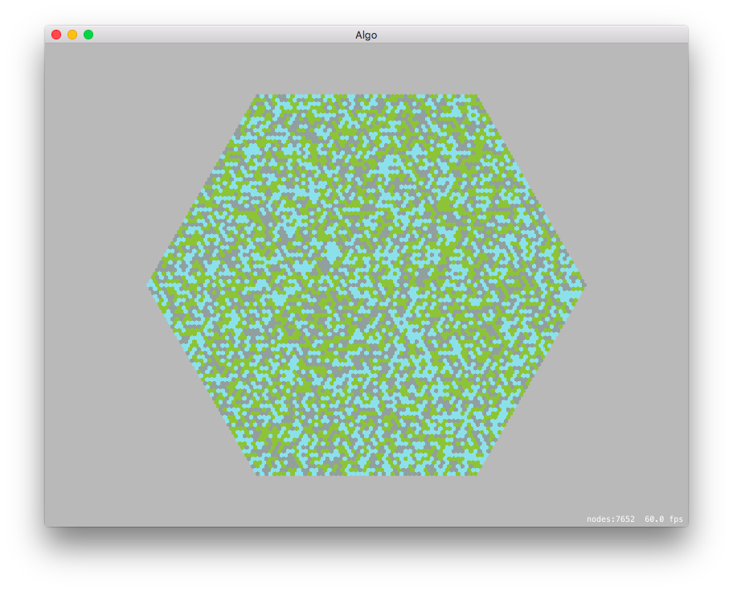

# Terrain Generator

This is an experiment in random terrain generation on a hexagonal grid. It's a Mac App written in Swift.

## Random

The random terrain generator just picks a random terrain type for each tile.



## Markov

The markov terrain generator uses a Markov matrix to choose what the next tile should be.


## Perlin Noise (maybe?)

The perlin noise terrain generator generates a grid of perlin noise, normalizes it and then choses the tile based on the value at that point.


## Hexagons

There is a small subproject, written in Ruby, called Hexagons. It generates the sprites used by the Swift project.

Usage:

```sh
bundle install
bundle exec ./hexagons.rb
```

That will create a subdirectory called `tiles` and place 10 `png` files in there. You can add or subtract files by adding or removing from the `colors` hash in the script.

# References

 * [RedBlobGames Hexagonal Grid Reference](http://www.redblobgames.com/grids/hexagons/) has been a huge help.
 * [How to Use Perlin Noise in Your Games](http://devmag.org.za/2009/04/25/perlin-noise/) from DevMag was also incredibly helpful (the perlin noise generator is basically a Swift port of their code).
 * The existing colors are pulled from [these tiles](http://opengameart.org/content/hexagon-tiles-93x) by [Kenney](http://www.kenney.nl)
