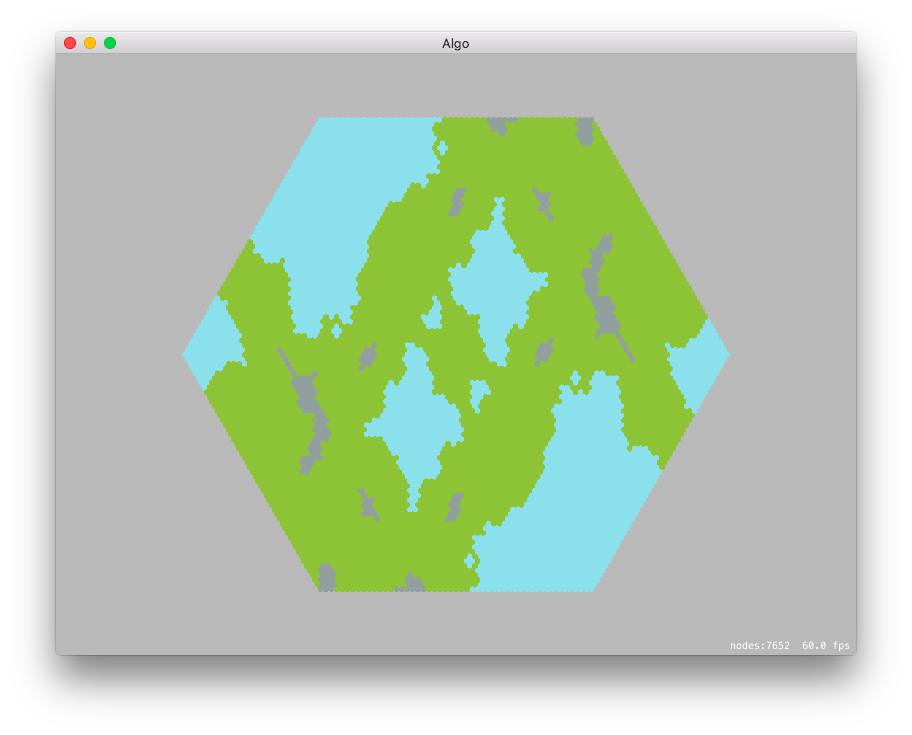

# Terrain Generator

This is an experiment in random terrain generation on a hexagonal grid. It's a Mac App written in Swift.

## Random

The random terrain generator just picks a random terrain type for each tile.

## Markov

The markov terrain generator uses a Markov matrix to choose what the next tile should be.

## Perlin Noise (maybe?)

The perlin noise terrain generator generates a grid of perlin noise, normalizes it and then choses the tile based on the value at that point.

# References

 * [RedBlobGames Hexagonal Grid Reference](http://www.redblobgames.com/grids/hexagons/) has been a huge help.
 * [How to Use Perlin Noise in Your Games](http://devmag.org.za/2009/04/25/perlin-noise/) from DevMag was also incredibly helpful (the perlin noise generator is basically a Swift port of their code.)
